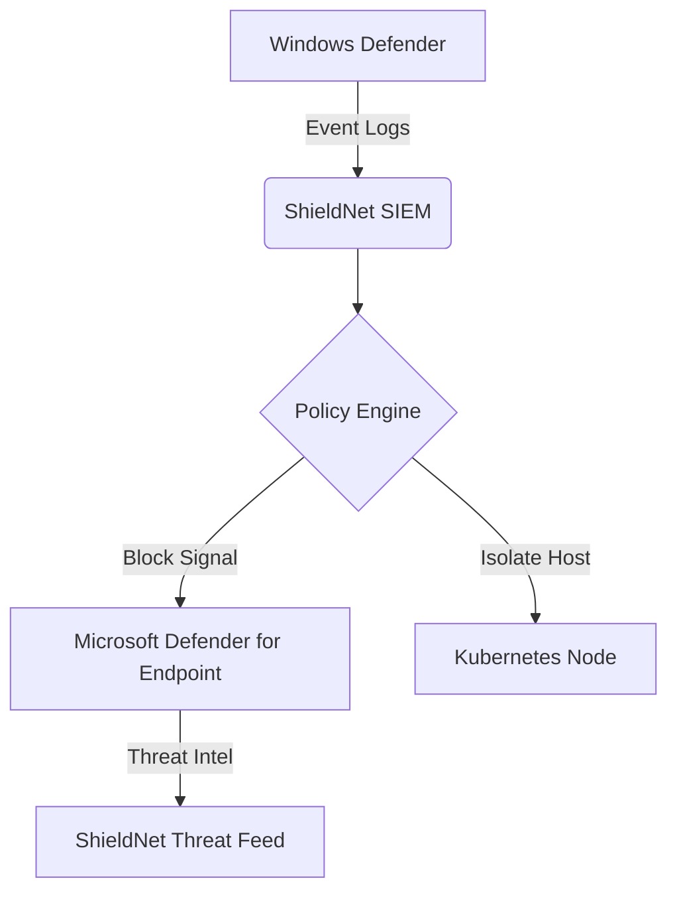

Here's the **Windows-specific security integration guide** for your ShieldNet deployment, incorporating Microsoft Defender best practices:

---

## Windows Security Integration Checklist

### 1. Microsoft Defender Antivirus Configuration
**Step-by-Step Setup:**
1. **Enable Real-Time Protection**
   ```powershell
   Set-MpPreference -DisableRealtimeMonitoring $false
   ```
2. **Configure Cloud-Delivered Protection**
   ```powershell
   Set-MpPreference -MAPSReporting Advanced
   ```
3. **Allow Critical URLs** (Add to Firewall Rules)
   ```powershell
   New-NetFirewallRule -DisplayName "DefenderCloud" -Direction Outbound -Action Allow -RemoteAddress "*.wdcp.microsoft.com","*.wd.microsoft.com"
   ```

### 2. Network Requirements for Defender
**Essential Endpoints to Whitelist:**
```markdown
| Service                  | URLs                                                                 |
|--------------------------|----------------------------------------------------------------------|
| Cloud Protection         | `*.wdcp.microsoft.com`, `*.wdcpalt.microsoft.com`                   |
| Security Intelligence    | `*.update.microsoft.com`, `ctldl.windowsupdate.com`                 |
| Malware Submission       | `uss*.blob.core.windows.net` (region-specific endpoints)            |
| Certificate Revocation   | `http://crl.microsoft.com/pki/crl/products`                         |
```

### 3. Validation Commands
**Check Defender Cloud Connection:**
```cmd
"%ProgramFiles%\Windows Defender\MpCmdRun.exe" -ValidateMapsConnection
```

**Verify Protection Status:**
```powershell
Get-MpComputerStatus | Select RealTimeProtectionEnabled, AMServiceEnabled
```

### 4. ShieldNet-Windows Integration
**Registry Modifications for Enhanced Security:**
```registry
[HKEY_LOCAL_MACHINE\SOFTWARE\Policies\Microsoft\Windows Defender]
"DisableAntiSpyware"=dword:00000000
"ServiceKeepAlive"=dword:00000001

[HKEY_LOCAL_MACHINE\SOFTWARE\Policies\Microsoft\Windows Defender\Spynet]
"SpynetReporting"=dword:00000002
"SubmitSamplesConsent"=dword:00000001
```

### 5. Windows-Specific ShieldNet Components
**Add to `shieldnet-windows.yaml`:**
```yaml
apiVersion: apps/v1
kind: DaemonSet
metadata:
  name: shieldnet-defender-integration
spec:
  template:
    spec:
      containers:
      - name: defender-monitor
        image: shieldnet/defender-integration:v2.1
        volumeMounts:
        - mountPath: /etc/defender
          name: defender-config
      volumes:
      - name: defender-config
        hostPath:
          path: C:\ProgramData\Microsoft\Windows Defender
```

### 6. Security Policy Alignment
**Group Policy Recommendations:**
```markdown
1. **Attack Surface Reduction**:
   - Block Office macros from internet
   - Enable Controlled Folder Access

2. **Network Protection**:
   - Enable SmartScreen for Edge/IE
   - Block connections to malicious IPs

3. **Exploit Protection**:
   - Enable DEP/ASLR system-wide
   - Block suspicious process creations
```

### 7. Event Log Monitoring
**Critical Windows Events to Track:**
```xml


  
    
      *[System[(Level=4 or Level=0) and (EventID=1006 or EventID=1007)]]
    
  

```

### 8. PowerShell Automation
**Security Health Check Script:**
```powershell
function Test-ShieldNetReadiness {
    $defender = Get-MpComputerStatus
    
    if (-not $defender.RealTimeProtectionEnabled) {
        Write-Warning "Real-time protection disabled"
        return $false
    }

    try {
        $mapsTest = & "$env:ProgramFiles\Windows Defender\MpCmdRun.exe" -ValidateMapsConnection
        if ($mapsTest -notmatch "Successfully established connection") {
            throw "MAPS connection failed"
        }
    } catch {
        Write-Error "Cloud protection test failed: $_"
        return $false
    }
    
    return $true
}
```

---

## Integration Architecture


**Key Synergies:**
1. **Unified Threat Detection**: Correlate Defender alerts with ShieldNet's AI-specific detections
2. **Automated Response**: Quarantine compromised nodes through Kubernetes admission controllers
3. **Centralized Logging**: Forward Defender events to ShieldNet's Elastic SIEM

---

## Critical Notes for Windows Deployments
1. **Certificate Requirements**:  
   Ensure proper CRL access for SSL validation:
   ```powershell
   Set-ItemProperty -Path "HKLM:\SOFTWARE\Policies\Microsoft\Windows Defender\Spynet" -Name "SSLOptions" -Value 3
   ```

2. **Update Channels**:  
   Maintain separate WSUS channels for:
   ```markdown
   - Security intelligence updates (hourly)
   - Engine updates (weekly)
   - Platform updates (monthly)
   ```

3. **Performance Optimization**:  
   ```registry
   [HKEY_LOCAL_MACHINE\SOFTWARE\Microsoft\Windows Defender\Scan]
   "AvgCPULoadFactor"=dword:00000050
   "CheckForSignaturesBeforeRunningScan"=dword:00000000
   ```

For hybrid deployments, combine this Windows-specific configuration with your existing ShieldNet Kubernetes setup through node affinity rules.

Citations:
[1] https://learn.microsoft.com/en-us/azure/defender-for-cloud/ai-threat-protection
[2] https://learn.microsoft.com/en-us/defender-endpoint/microsoft-defender-security-center-antivirus
[3] https://github.com/MicrosoftDocs/defender-docs/blob/public/defender-endpoint/configure-network-connections-microsoft-defender-antivirus.md
[4] https://ironscales.com/guides/microsoft-365-defender/microsoft-defender-licenses
[5] https://www.process.st/how-to/turn-on-microsoft-defender-antivirus/
[6] https://www.itpro.com/desktop-software/26635/how-to-turn-on-windows-defender
[7] https://play.google.com/store/apps/details?id=com.microsoft.scmx
[8] https://www.lifewire.com/discover-windows-defender-security-center-8736608

